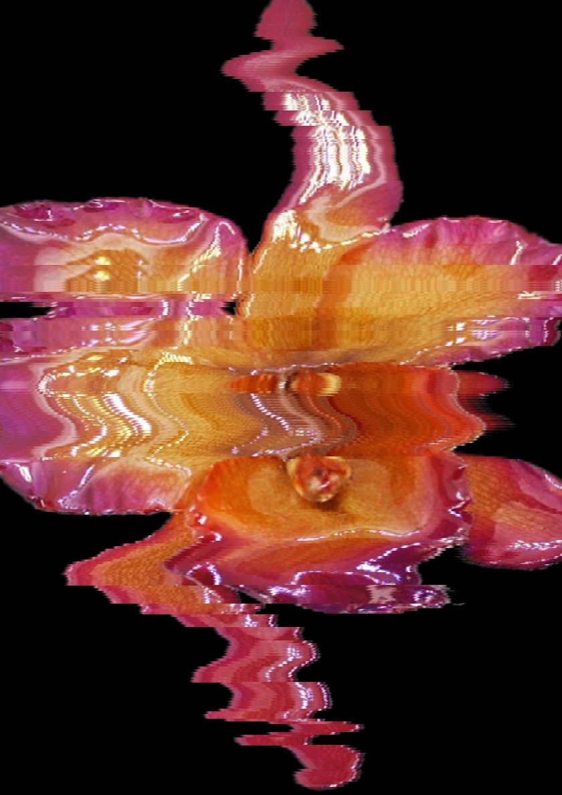
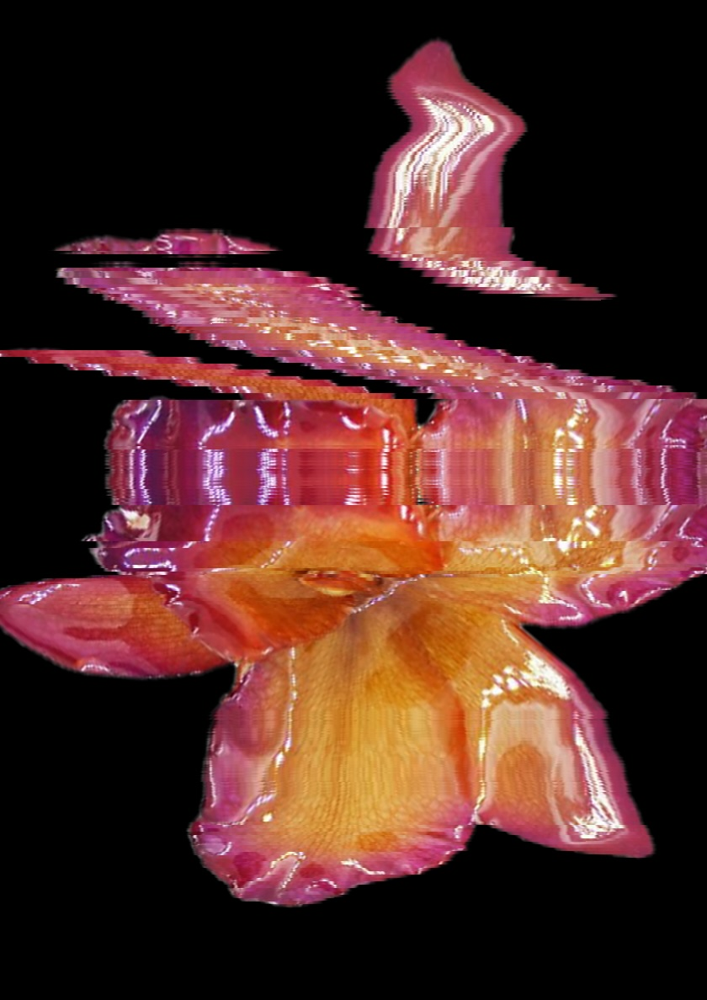
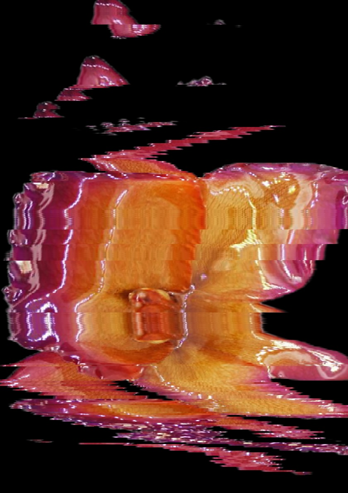

# bit-scan
BitScan lets you distort images to make them look like a glitched photo copy.

---

For [Leans (*girlpage*)](https://github.com/girlpage/) open call *[mod.lab](https://www.mod-lab.org/)* i have built a creative tool that lets you manipulate images to make them look like distorted scans / photocopies. 

The tool is inspired by the [slit-scan photography](https://en.wikipedia.org/wiki/Slit-scan_photography) technique, various examples of artists using real photocopiers and by the popular [time wrap can filter](https://www.tiktok.com/tag/timewarpscan) on tiktok. 

  

*(some examples using an orchid. original image source: https://pin.it/1TdZG7RQK)*

## how to use

you can either download the [source file](bitScan.pde) and edit and run it using [processing](https://processing.org/download) or you could download the executable file for your specific operating System and Processor.

After you've opened bitScan
1. choose an image (.jpeg, .tif, .png, ...)
2. scale the image to your liking
3. click on "start scan", press SPACE when you're ready.
4. move your mouse around in the window, rotate the image with the "A" and "S" keys until the scan is done.
5. save the image if you want. (keep in mind that the program will overwrite files with the same without warning).
6. repeat!

### notes on the Apple Silicon executable. 

The apple silicon installation requires that you have [openJDK 17](https://openjdk.org/projects/jdk/17/) installed.

It may be that you can't open the file at first because MacOS believes that the file is either corrupted or unsafe.
In that case, try to right click the file and then click on "open" or open your terminal and excecute

```bash
xattr -cr {adress to your executable}/bitScan.app
```

(you can just write `xattr -cr `  and then drag and drop the bitScan.app file into your terminal.


